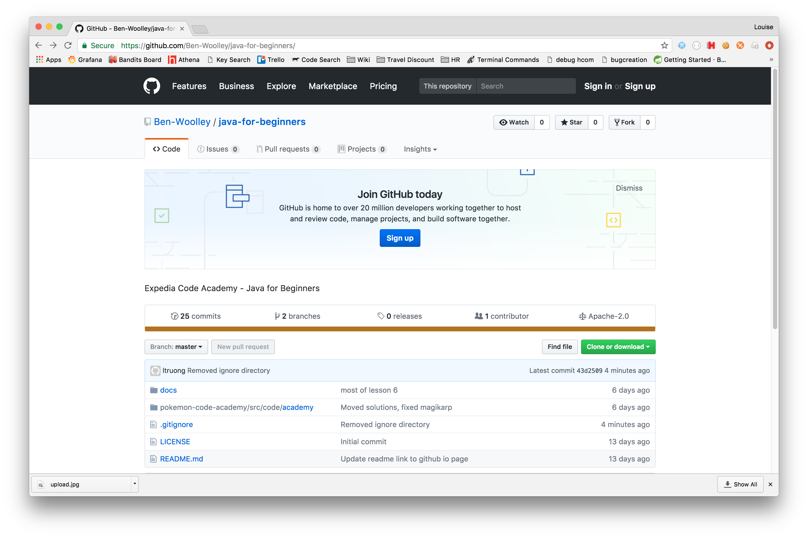
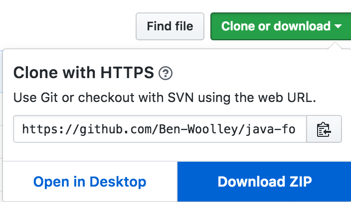
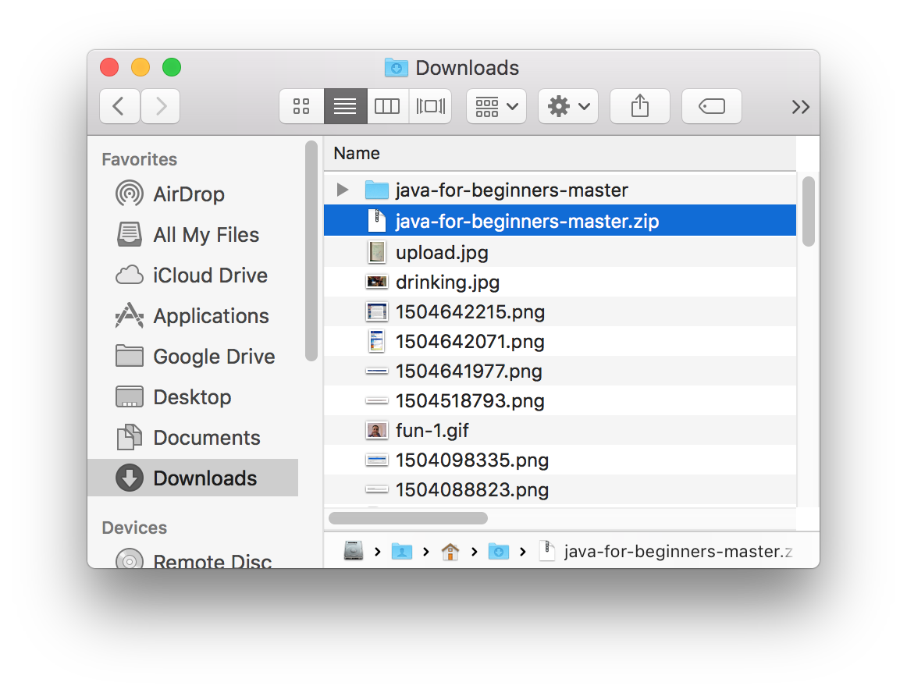

# Setting up the pokemon template

## Downloading the project 

1. Go to the github link and click the green "Clone or download" button

2. Download the project as a zip

3. In your downloads folder you should have a zip folder, unzip it which will create the project folder. If you're using a Mac double click the folder, if you're using Windows right click the folder then click unzip.

  You can move the folder to wherever you feel like it e.g. Documents, it doesn't have to stay in the Downloads folder.

---

## Importing the project to IntelliJ
 
1. Open up IntelliJ and click Import Project

2. You don't need to click anything here just press Next

3. Press next again

4. Press next again

5. Press next again

6. Press next again

7. Press next one last time!

8. Now the project is ready to go! You can open up the folders and start coding away :)
