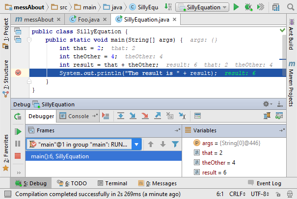

# Bonus: Debugging Your Code

Right-click and debug , this is a feature of the editor!

Debugging lets us see what happens when we run our code.
We can see everything step-by-step by using several features:
*  **Breakpoints** are what let you stop and see what's happening at a particular line in code.
These are set by clicking next to the line number in the editor that you want to stop at.
*  **Step over** - run the highlighted line and wait at the next.
*  **Step in** - Run the highlighted line of code, and if it calls a function go to it's first line.
*  **Step out** - Finish running the current "block" of code (between two `{braces}`) and go to the line after the line that called it originally.

While at a breakpoint you can see what all the variables available look like in the debug pane.

### Exercise
Try out debugging and using each of the features.
To try step in and step out, create your own method that you call from the `main` method. This can be as simple as `sum(Integer a, Integer b)` that adds `a` and `b` together.

---
[Homepage](index.md)