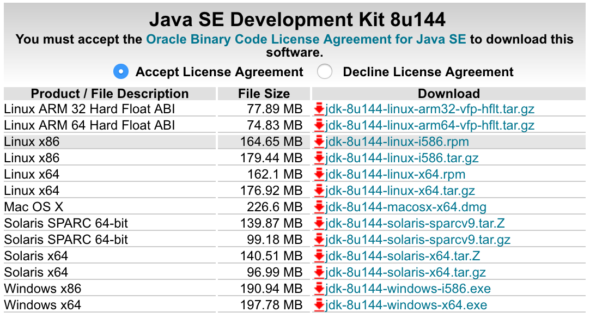
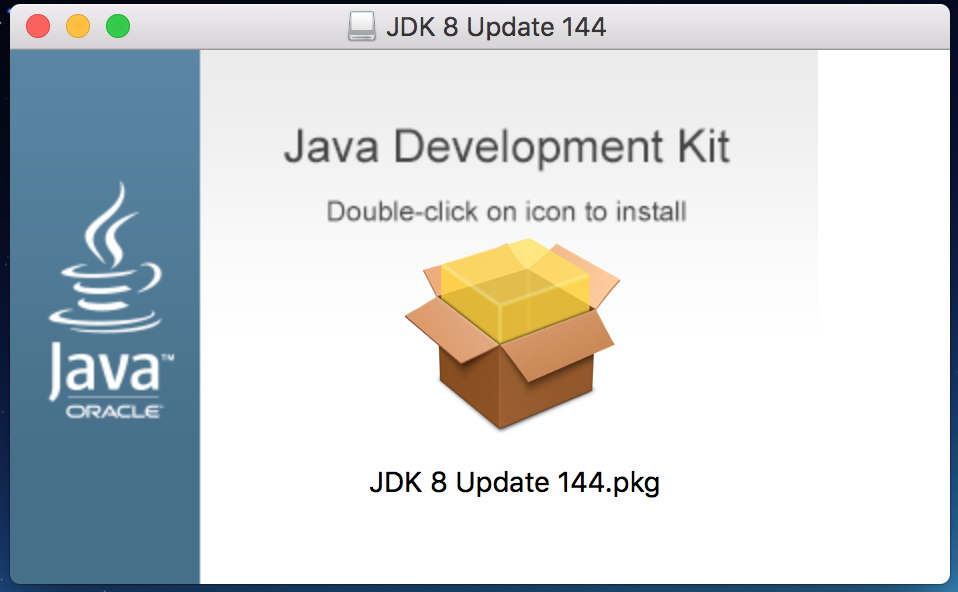
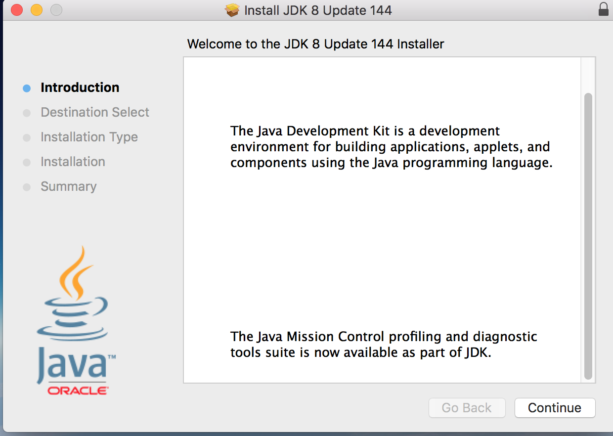
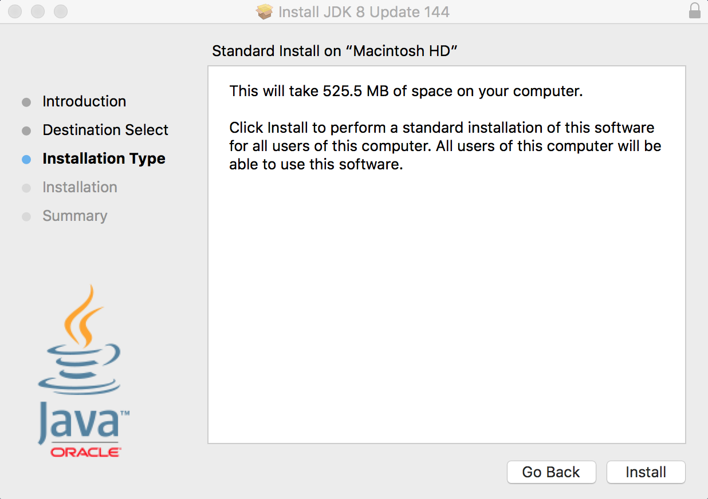
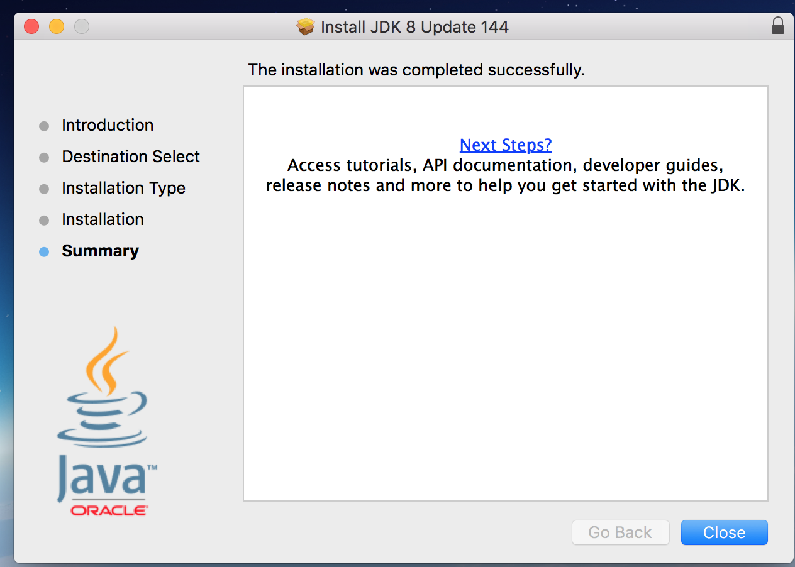

# Setting up the Java SDK

This will walk you through downloading and setting up the Java Source Development Kit (SDK)

## Downloading Java

The download for the file can be found here:
[Download Page](http://www.oracle.com/technetwork/java/javase/downloads/jdk8-downloads-2133151.html)

1. You will need to click the "Accept License Agreement" button before being able to download the software:

2. Then, click on the file depending on what operating system you are using (Mac OSX, Windows 32bit, Windows 64bit, etc)
Accept the download prompt and save it wherever you please.

3. After the download has finished, open the file and you should see this image (on OSX).

You should then be greeted by this screen:

4. Click continue, and then click install:

(Note: At this point you may have to input your password)

Once the installation finishes, you should see this page:

5. To test that the installation has been successful, you can open a Terminal (on OSX) or Command Prompt (on Windows) and type 'java -version':

---
[Homepage](index.md)
