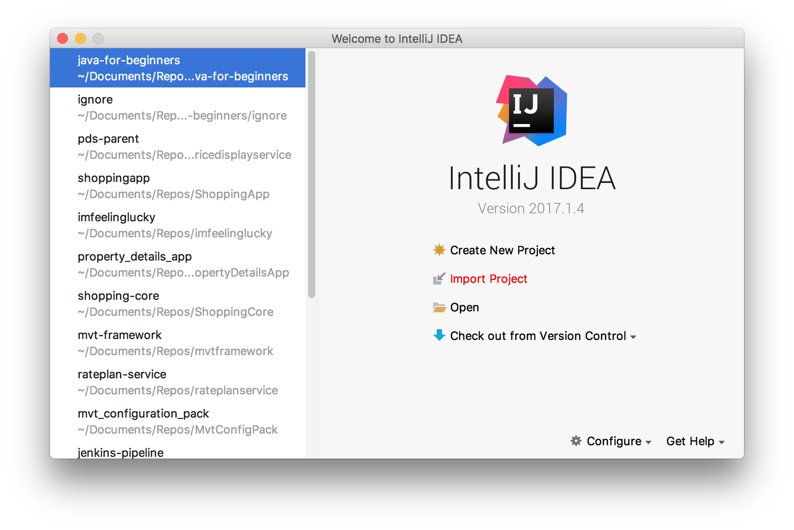
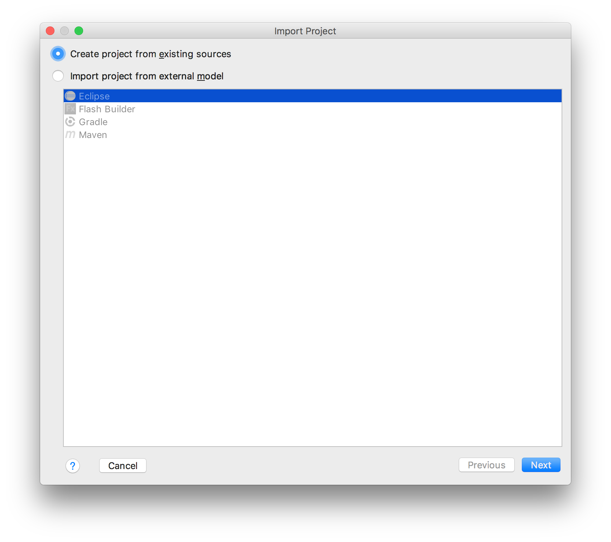
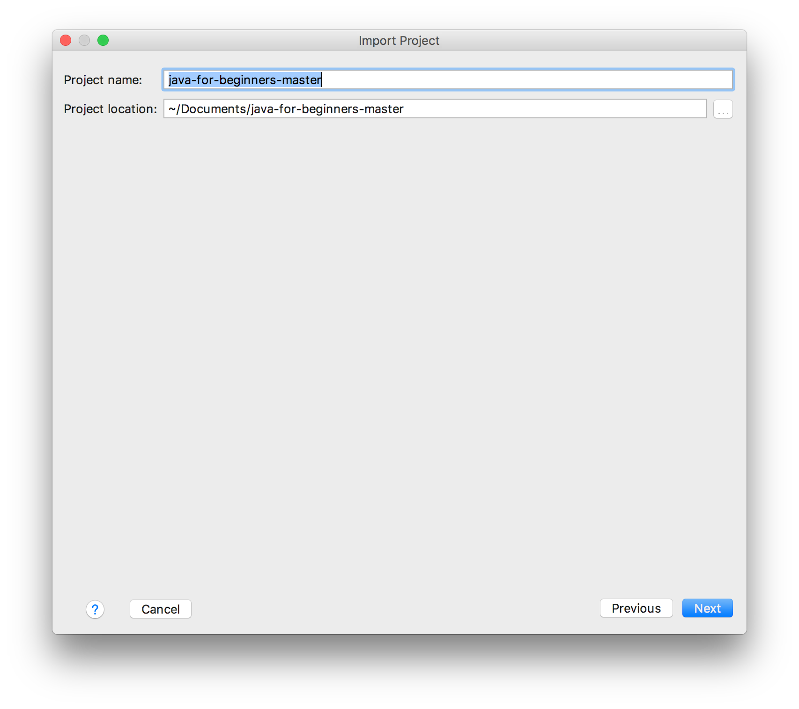
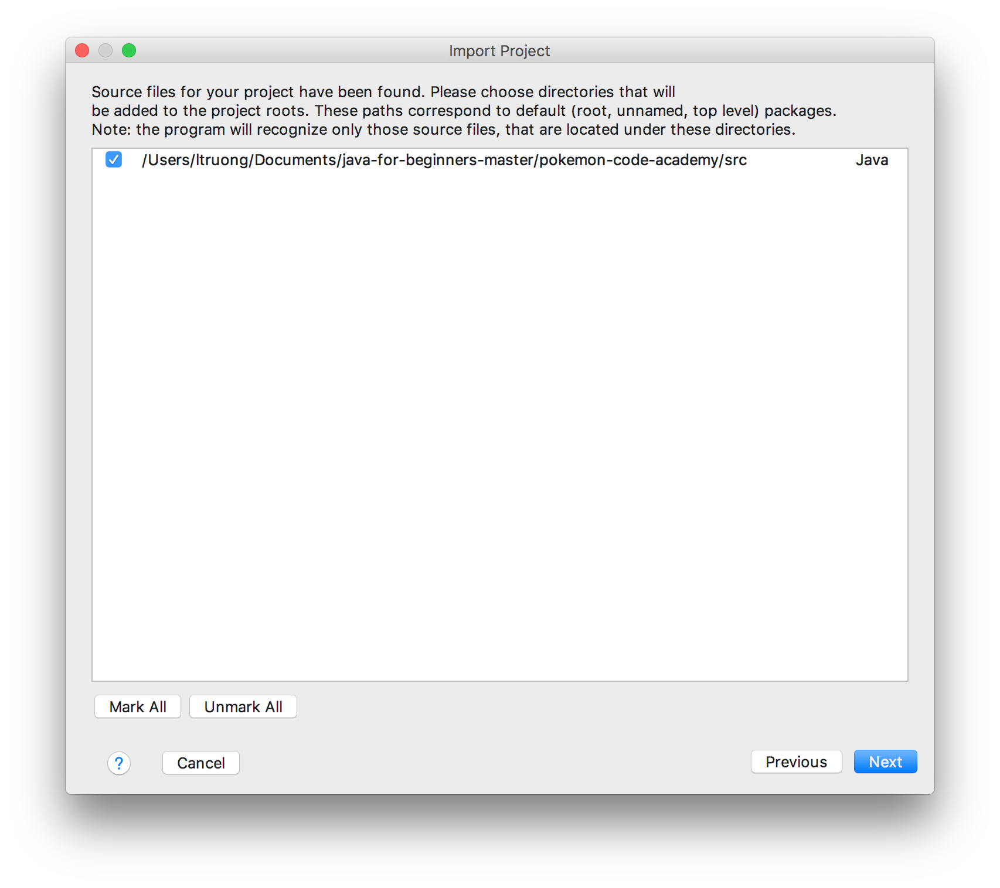
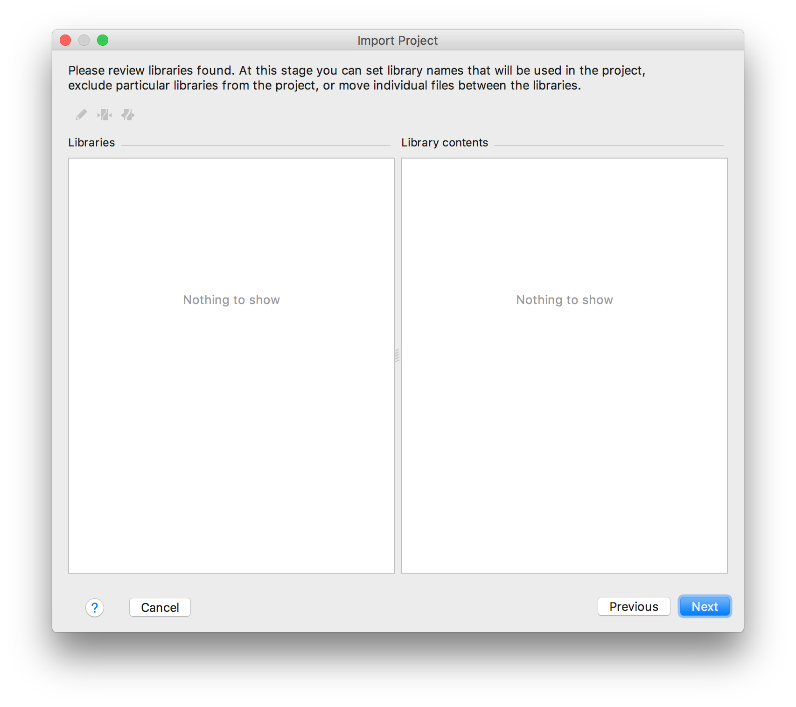
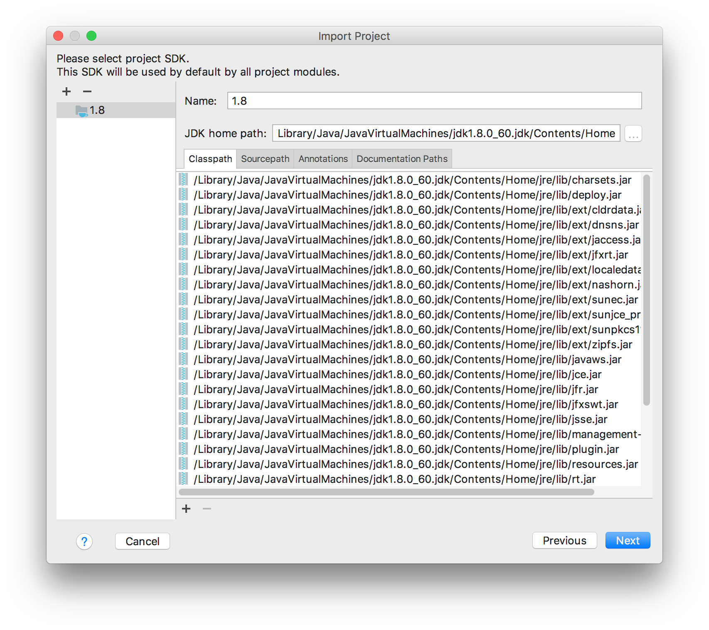
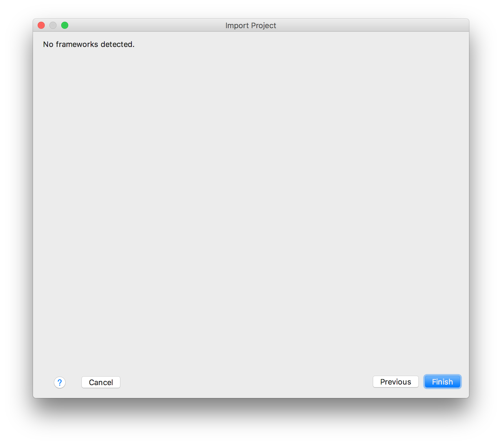
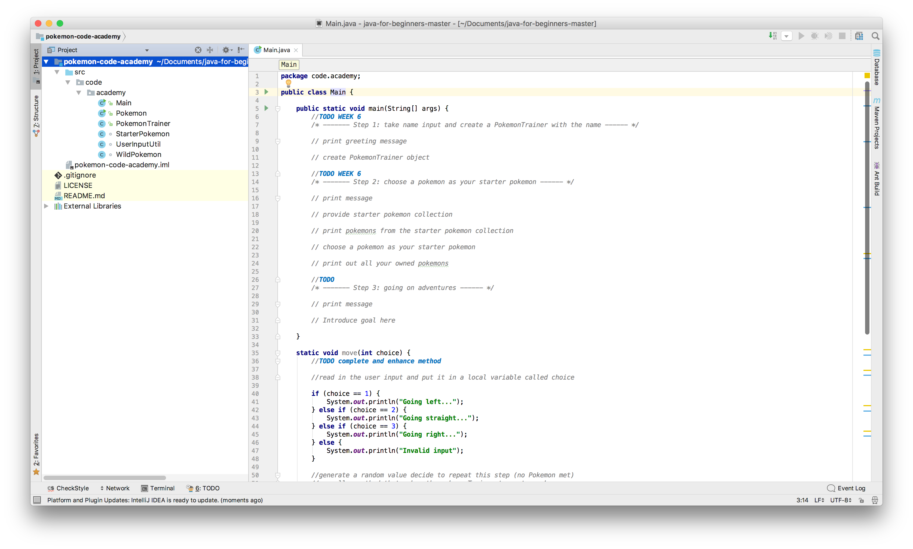

# Setting up the Java for Beginners project

You have 2 options to download and import the project. Either via IntelliJ itself or manually using the terminal/command line.

## Using IntelliJ
You can simply use "Check out from Version Control" in IntelliJ. This will automatically clone the project once you provide the URL.

You may need to add the Java JDK manually after the project is imported.

## Using the terminal
### Downloading the project
We're going to do this from the command line/terminal using **git**. To clone the project:
* Create a folder somewhere for your git project to exist in e.g. `gitProjects` in your Documents folder.
* Open a terminal/command line and go to the `gitProjects` folder you just created.
* Clone the repository here using:
`git clone https://github.com/Ben-Woolley/java-for-beginners.git`

### Importing the project to IntelliJ

If you **did not** create a new project from version control. You will need to import the project like so:

1. Open up IntelliJ and click Import Project

2. You don't need to click anything here just press Next

3. Press next again

4. Press next again

5. Press next again

6. Make sure you have a project SDK selected, this is what will run your Java application. Click the + button and point at the `bin` directory inside where you installed your Java 8 JDK.

7. Press next one last time!

8. Now the project is ready to go! You can open up the folders and start coding away.

---
[Homepage](../index.md)
